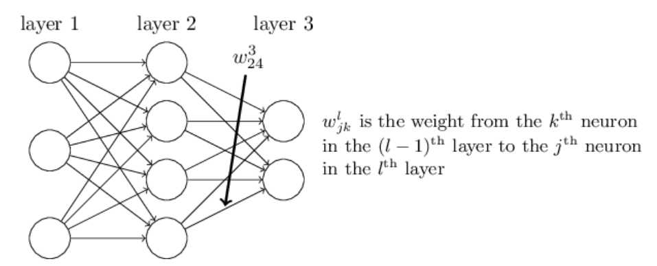
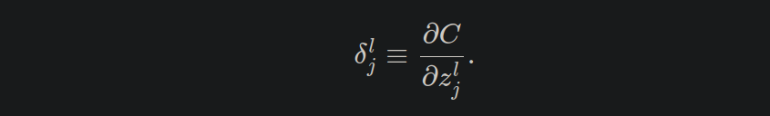
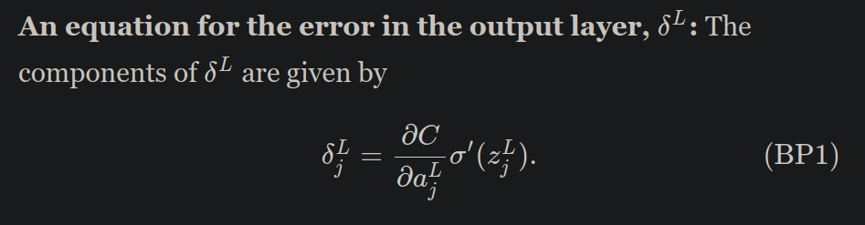
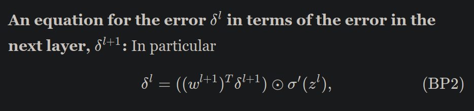
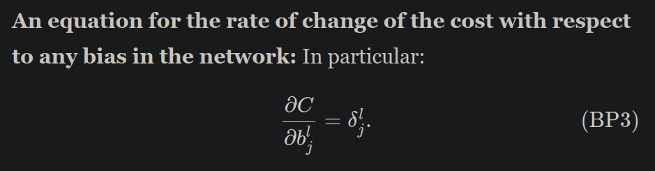
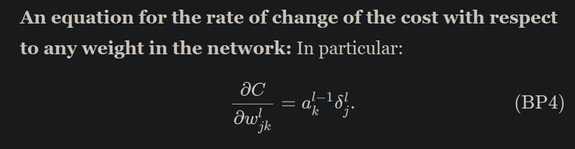
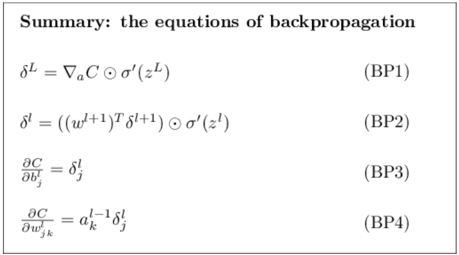

# Image Colorization

The SoC 2021 project.

# Useful Links

A Machine Learning course
[here](https://www.coursera.org/learn/machine-learning)  
Notes on Machine Learning
[here](http://cs229.stanford.edu/summer2019/cs229-notes1.pdf)

# Linear Regression

The main aim is to estimate a linear equation representing the given set
of data. There are two approaches to this.  
1. A closed form solution.  
This can be directly obtained by solving the linear differential
equation. 2. An iterative approach.  
This is similar to **Gradient Descent**. We try to obtain the minima (
*L*1, *L*2
norm etc) by calculating the gradient at each point and moving in small
steps along the gradient vector. Refer to
[this](https://youtu.be/8PJ24SrQqy8) video for more details. 
## Logistic Regression 
Refer to the following
[link](https://towardsdatascience.com/logistic-regression-detailed-overview-46c4da4303bc)
to see an example of logistic regression.

# Gradient Descent

[Here](https://youtu.be/sDv4f4s2SB8) is a useful video.  
An article about Gradient Descent
[here](https://medium.com/@lachlanmiller_52885/machine-learning-week-1-cost-function-gradient-descent-and-univariate-linear-regression-8f5fe69815fd)  
A useful post on GeeksForGeeks
[here](https://www.geeksforgeeks.org/gradient-descent-algorithm-and-its-variants/)

# Deep Learning

A book on deep learning
[here](http://neuralnetworksanddeeplearning.com/index.html)

## Chapter 1 - Using neural nets to recognize handwritten digits

### Perceptrons

So how do perceptrons work? A perceptron takes several binary inputs,
*x*<sub>1</sub>, *x*<sub>2</sub>, …,
and produces a single binary output.  
  
A way you can think about the perceptron is that it’s a device that
makes decisions by weighing up the evidence. By varying the weights and
the threshold, we can get different models of decision-making. Using the
bias instead of the threshold, the perceptron rule can be rewritten:  
  
Another way perceptrons can be used is to compute the elementary logical
functions we usually think of as underlying computation, functions such
as AND, OR, and NAND.

### Sigmoid Neurons

A small change in the weights or bias of any single perceptron in the
network can sometimes cause the output of that perceptron to completely
flip, say from 0 to 1. We can overcome this problem by introducing a new
type of artificial neuron called a sigmoid neuron. Sigmoid neurons are
similar to perceptrons, but modified so that small changes in their
weights and bias cause only a small change in their output. That’s the
crucial fact which will allow a network of sigmoid neurons to learn.  
Just like a perceptron, the sigmoid neuron has inputs, *x*1, *x*2, ….
But instead of being just 0 or 1, these inputs can also take on any
values between 0 and 1. So, for instance, 0.638… is a valid input for a
sigmoid neuron. Also just like a perceptron, the sigmoid neuron has
weights for each input, *w*1, *w*2, …, and an overall bias, *b*. But the
output is not 0 or 1. Instead, it’s *σ*(*w*⋅*x*+*b*), where *σ* is
called the sigmoid function.  
To understand the similarity to the perceptron model, suppose
*z* ≡ *w* ⋅ *x* + *b* is a large positive number. Then *e* − *z* ≈ 0 and
so *σ*(*z*) ≈ 1. In other words, when *z* = *w* ⋅ *x* + *b* is large and
positive, the output from the sigmoid neuron is approximately 1, just as
it would have been for a perceptron. Suppose on the other hand that
*z* = *w* ⋅ *x* + *b* is very negative. Then *e* − *z* → ∞, and
*σ*(*z*) ≈ 0. So when *z* = *w* ⋅ *x* + *b* is very negative, the
behaviour of a sigmoid neuron also closely approximates a perceptron.

### Neural Networks Architecture

A typical neural network consists of an input layer, an output layer and
0 or more hidden layers. *Hidden Layers* are just layers which are
neither the input layer nor the output layer. Each layer consists
neurons whose input is taken from the previous layer and the output acts
like the input to the next layer.  
Each layer in the neural network captures an abstraction/feature of the
object/data we are trying to learn. For example, the digit recognition
neural network has 3 layers. The input layer consists of 784(28\*28)
neurons and the output layer has 10 neurons each corresponding to an
identity of a digit. The hidden layer has 20 neurons. One may think of
the hidden layer as capturing the main features of a digit such as
loops, curves and straight lines.  
The aim of a neural network is to learn the input data and output the
corresponding label to a particular input. To do this, we define a
**cost function**. For example, in the digit recognition neural network,
we use a *least squared error* norm to minimise the error in the output.
This function is particularly useful because it is convex and it is
minimized when the output of the neural network matches the correct
output.  


To minimise the cost function, we use a calculus approach. Notice that
the above cost function is a function of all the weights and biases in
the network. We aim to minimise the cost function for a given input
dataset by tuning the weights and biases in the network. We tweak each
of these variables (weights and biases) and measure the change in the
cost function for *all* the inputs. This way, we identify the **gradient
of the function**. We move in the negative direction of the gradient to
minimise the cost function. We repeat this until convergence (A
threshold accuracy). This algorithm is called as **Gradient Descent**.  
  
Here, *η* refers to the **learning rate** and is one of the
*hyperparameters*.

In the above algorithm, we calculated the cost function for all the
inputs in each iteration. This turns out to be a computationally
expensive step. Therefore, we select a **mini-batch** from the input and
evaluate the cost function over this input. We assume that this cost
function is a representative of the real cost function. We change the
mini-batch in each iteration so as to cover all the inputs. The change
in the cost function looks like this:  
  
*Note* The above cost function is taken as an average to maintina
consistency in the mini-batches method.

In summary, we take a random set of weights and biases and perform
gradient descent on a subset of inputs to obtain the optimal set of
parameters. This method is called as **Stochastic Gradient Descent**.
(Stochastic refers to the random initial start and random mini-batches).

### Implementation of Neural Networks

The following code is taken from the book. We implement Neural Networks
in Python for the rest of the document.  
**The Network Class**

``` python
class Network(object):

    def __init__(self, sizes):
        self.num_layers = len(sizes)
        self.sizes = sizes
        self.biases = [np.random.randn(y, 1) for y in sizes[1:]]
        self.weights = [np.random.randn(y, x) 
                        for x, y in zip(sizes[:-1], sizes[1:])]
```

**The Feed Forward Mechanism**

``` python
def feedforward(self, a):
        """Return the output of the network if "a" is input."""
        for b, w in zip(self.biases, self.weights):
            a = sigmoid(np.dot(w, a)+b)
        return a
```

**The Stochastic Gradient Descent Method**

``` python
def SGD(self, training_data, epochs, mini_batch_size, eta,
            test_data=None):
        """Train the neural network using mini-batch stochastic
        gradient descent.  The "training_data" is a list of tuples
        "(x, y)" representing the training inputs and the desired
        outputs.  The other non-optional parameters are
        self-explanatory.  If "test_data" is provided then the
        network will be evaluated against the test data after each
        epoch, and partial progress printed out.  This is useful for
        tracking progress, but slows things down substantially."""
        if test_data: n_test = len(test_data)
        n = len(training_data)
        for j in xrange(epochs):
            random.shuffle(training_data)
            mini_batches = [
                training_data[k:k+mini_batch_size]
                for k in xrange(0, n, mini_batch_size)]
            for mini_batch in mini_batches:
                self.update_mini_batch(mini_batch, eta)
            if test_data:
                print "Epoch {0}: {1} / {2}".format(
                    j, self.evaluate(test_data), n_test)
            else:
                print "Epoch {0} complete".format(j)
```

**The Back Propagation Algorithm**
``` python   
def backprop(self, x, y):         
    """Return a tuple ``(nabla_b, nabla_w)`` representing the         
    gradient for the cost function C_x.  ``nabla_b`` and         
    ``nabla_w`` are layer-by-layer lists of numpy arrays, similar         
    to ``self.biases`` and ``self.weights``."""         
    nabla_b = [np.zeros(b.shape) for b in self.biases]         
    nabla_w = [np.zeros(w.shape) for w in self.weights]         
    # feedforward         
    activation = x         
    activations = [x] # list to store all the activations, layer by layer         
    zs = [] # list to store all the z vectors, layer by layer         
    for b, w in zip(self.biases, self.weights):             
        z = np.dot(w, activation)+b             
        zs.append(z)             
        activation = sigmoid(z)             
        activations.append(activation)         
    # backward pass         
    delta = self.cost_derivative(activations[-1], y) * \             
        sigmoid_prime(zs[-1])         
    nabla_b[-1] = delta         
    nabla_w[-1] = np.dot(delta, activations[-2].transpose())         
    # Note that the variable l in the loop below is used a little         
    # differently to the notation in Chapter 2 of the book.  Here,         
    # l = 1 means the last layer of neurons, l = 2 is the         
    # second-last layer, and so on.  It's a renumbering of the         
    # scheme in the book, used here to take advantage of the fact         
    # that Python can use negative indices in lists.         
    for l in xrange(2, self.num_layers):             
        z = zs[-l]             
        sp = sigmoid_prime(z)             
        delta = np.dot(self.weights[-l+1].transpose(), delta) * sp             
        nabla_b[-l] = delta             
        nabla_w[-l] = np.dot(delta, activations[-l-1].transpose())         
   return (nabla_b, nabla_w) 
```
*Note* Back Propagation was not discussed until here. It will be
discussed in the next chapter.

### Observations

The weights and biases are called as *parameters* whereas the size of a
mini-batch, number of epochs (The number of times SGD is repeated over
the whole input) and learning rate are called as *hyperparameters*.
These hyperparameters play a crucial role in the time taken for training
the network. They must be chosen with care and they can be tuned based
on the observation made from the output.

A deep neural network is able to learn complex data due to its
hierarchical structure. Each layer captures a level of abstraction which
is used by the next layer to determine a higher level of features in the
data.

## Chapter 2 - How the backpropagation algorithm works

### A Matrix based approach for faster calculations

All the above equations in the network are written in terms of
summations. We can easily replace them using matrix representation. This
allows faster calculations and does away with index representation. In
our notation, we shall use
*w*<sub>*j**k*</sub><sup>*l*</sup>
to denote the weight for the connection from the
*k*
th neuron in the (*l*−1)th layer to the *j*th neuron in the *l*th layer.



*Note.* The notation is reverse from what is expected.

We use a similar notation for the network’s biases and activations.
Explicitly, we use *b*<sub>*j*</sub><sup>*l*</sup> for the bias of the
*j*th neuron in the *l*th layer. And we use
*a*<sub>*j*</sub><sup>*l*</sup> for the activation of the *j*th neuron
in the *l*th layer. Therefore, we have
*a*<sub>*j*</sub><sup>*l*</sup> = *σ*(∑<sub>*k*</sub>*w*<sub>*j**k*</sub><sup>*l*</sup>*a*<sub>*k*</sub><sup>*l* − 1</sup>+*b*<sub>*j*</sub><sup>*l*</sup>) ⟹ *a*<sup>*l*</sup> = *σ*(*w*<sup>*l*</sup>*a*<sup>*l* − 1</sup>+*b*<sup>*l*</sup>)
. Also, define $ z^l\_j = \_k w<sup>l\_{jk}a\_k</sup>{l-1} + b^l\_j $ .

### Assumptions about the cost function

1.  Cost function is written as an average. This allows us to use
    mini-batches without any further complications.
2.  Cost function can be written in terms of the outputs from the neural
    network.

### The Hadamard Product

The Hadamard/Schur product is defined as
(*s*⨀*t*)<sub>*j*</sub> = *s*<sub>*j*</sub> \* *t*<sub>*j*</sub>.

### The Four Fundamental Equations of Back Propagation

Let us get familiar with some notation before moving forward. We define
*δ*<sub>*j*</sub><sup>*l*</sup> of neuron *j* in layer *l* by,



It represents the change in the cost function when
*z*<sub>*j*</sub><sup>*l*</sup> is changed. The equations are as
follows:

1.  

    Notice that *B**P*1 can be easily calculated if we know the partial
    derivative in the above equation. It can be rewritten in the matrix
    form as,
    *δ*<sup>*L*</sup> = ∇<sub>*a*</sub>*C*⨀*σ*′(*z*<sup>*L*</sup>). The
    above equation only talks about the output and change in the output
    layer!

2.  

    It represents the change in *z*<sup>*l* + 1</sup> with respect to a
    change in *z*<sup>*l*</sup>. By combining *B**P*2 with *B**P*1 we
    can compute the error *δ*<sup>*l*</sup> for any layer in the
    network. We start by using *B**P*1 to compute ,
    then*δ*<sup>*l*</sup> apply Equation *B**P*2 to compute
    *δ*<sup>*l* − 1</sup>, then Equation *B**P*2 again to compute
    *δ*<sup>*l* − 1</sup>, and so on, all the way back through the
    network.

3.  

    Until now, the equations were written in terms of the output at each
    neuron. The above equation holds due to the definition of
    *δ*<sub>*j*</sub><sup>*l*</sup>.

4.  

    This equation is similar to the previous one. Each
    *w*<sub>*j**k*</sub><sup>*l*</sup> is associated with the output
    from the previous layer which brings
    *a*<sub>*k*</sub><sup>*l* − 1</sup> into the picture.
    *a*<sub>*k*</sub><sup>*l* − 1</sup> is the output from the previous
    layer.

#### Conclusions from the above Equations

-   When the activation *a*in is small, *a*in≈0, the gradient term
    ∂*C*/∂*w* will also tend to be small. This is true for any cost function.
-   A weight in the final layer will learn slowly if the output neuron
    is either low activation (≈0) or high activation (≈1). In this case
    it’s common to say the output neuron has *saturated* and, as a
    result, the weight has stopped learning (or is learning slowly).
    Similar remarks hold also for the biases of output neuron. We can
    obtain similar insights for earlier layers. And this, in turn, means
    that any weights input to a saturated neuron will learn slowly (if
    the number of inputs is small).  
    **Note** This conclusion holds true only for sigmoid neurons.
-   The four fundamental equations turn out to hold for any activation
    function, not just the standard sigmoid function.

The equations are summarised as:



### Advantages of Back Propagation  
This algorithm is extremely fast as it requires only one forward pass and one backward pass. If we were to solve this problem conventionally, we would have proceeded in the following manner. For each weight and bias in the network, we would have calculated the change in the output/cost function with respect to to the change in the parameter being considered. This is basically from the first principles of calculus. Notice that we repeat this process for each weight and bias and the network. If there were a million parameters, we would have million forward and backward passes.  
The elegancy of Back propagation is visible in this scenario. We calculate the gradients of all parameters in a single go. Therefore, Back Propagation provides an intuitive and simple method to train our network via gradient descent.  

## Chapter 3 - Improving the way neural networks learn  
Content in this chapter: Improving cost functions - cross-entropy cost function; Regularization methods - L1, L2, dropout, artificial expansion of training data; Weights initializationl Heuristics for hyperparameters.

### The cross entropy cost function
Usually, humans learn faster when they make bigger errors. Although, neural networks are not so simple and they behave differently. From the example given in the book, the network (with a single neuron) is learning slowly when the error is high.  
This fact can be attributed to the shape of the sigmoid function. In one of our previous conclusions, we've written down that the network learns slowly when a neuron is near saturation. The shape of the sigmoid flattens near the ends.  
Although, this is not solely due to the sigmoid function. When the gradient of the quadratic cost function is calculated, the derivative activation term remains. Therefore, the quadratic cost function causes the flatness of the sigmoid function near the ends to show up in the gradient terms and decreases the learning rate.  
How do we solve this problem? It turns out that we can solve the problem by replacing the quadratic cost with a different cost function, known as the cross-entropy.  
  
Two properties in particular make it reasonable to interpret the cross-entropy as a cost function. First, it's non-negative, that is, C>0. Second, if the neuron's actual output is close to the desired output for all training inputs, x, then the cross-entropy will be close to zero. Here, the desired outputs are either 0 or 1. These are both properties we'd intuitively expect for a cost function.  
But the cross-entropy cost function has the benefit that, unlike the quadratic cost, it avoids the problem of learning slowing down. Let us calculate the partial derivative to see this.  
  
For the sigmoid function, σ′(z)=σ(z)(1−σ(z)). Therefore, the gradient becomes,  
  
The larger the error, the faster the neuron will learn. This is just what we'd intuitively expect. In particular, it avoids the learning slowdown caused by the σ′(z) term in the analogous equation for the quadratic cost.  

Who cares how fast the neuron learns, when our choice of learning rate was arbitrary to begin with?! That objection misses the point. The point of the graphs isn't about the absolute speed of learning. It's about how the speed of learning changes. In particular, when we use the quadratic cost learning is slower when the neuron is unambiguously wrong than it is later on, as the neuron gets closer to the correct output; while with the cross-entropy learning is faster when the neuron is unambiguously wrong. Those statements don't depend on how the learning rate is set.  
There is, incidentally, a very rough general heuristic for relating the learning rate for the cross-entropy and the quadratic cost. As we saw earlier, the gradient terms for the quadratic cost have an extra σ′=σ(1−σ) term in them. Suppose we average this over values for σ, ∫10dσσ(1−σ)=1/6. We see that (very roughly) the quadratic cost learns an average of 6 times slower, for the same learning rate. This suggests that a reasonable starting point is to divide the learning rate for the quadratic cost by 6.  

When should we use the cross-entropy instead of the quadratic cost? In fact, the cross-entropy is nearly always the better choice, provided the output neurons are **sigmoid neurons**. By now, we've discussed the cross-entropy at great length. Why go to so much effort when it gives only a small improvement to our MNIST results? Part of the reason is that the cross-entropy is a widely-used cost function, and so is worth understanding well. But the more important reason is that neuron saturation is an important problem in neural nets, a problem we'll return to repeatedly throughout the book.

#### Intuition behind cross-entropy
what could have motivated us to think up the cross-entropy in the first place? Suppose we'd discovered the learning slowdown described earlier, and understood that the origin was the σ′(z) terms in Equations (55) and (56). After staring at those equations for a bit, we might wonder if it's possible to choose a cost function so that the σ′(z) term disappeared. We then integrate and try to find such a cost function. The cross-entropy isn't something that was miraculously pulled out of thin air. Rather, it's something that we could have discovered in a simple and natural way.  

 However, it is worth mentioning that there is a standard way of interpreting the cross-entropy that comes from the field of information theory. Roughly speaking, the idea is that the cross-entropy is a measure of surprise. In particular, our neuron is trying to compute the function x→y=y(x). But instead it computes the function x→a=a(x). Suppose we think of a as our neuron's estimated probability that y is 1, and 1−a is the estimated probability that the right value for y is 0. Then the cross-entropy measures how "surprised" we are, on average, when we learn the true value for y. We get low surprise if the output is what we expect, and high surprise if the output is unexpected.  Wikipedia contains a [brief summary](http://en.wikipedia.org/wiki/Cross_entropy#Motivation) regarding this.
 
### Softmax
 The idea of softmax is to define a new type of output layer for our neural networks. It begins in the same way as with a sigmoid layer, by forming the weighted inputs.  However, we don't apply the sigmoid function to get the output. Instead, in a softmax layer we apply the so-called softmax function to the zLj. According to this function, the activation aLj of the jth output neuron is  
   
 The outputs are possitive and add up to 1. The fact that a softmax layer outputs a probability distribution is rather pleasing. In many problems it's convenient to be able to interpret the output activation aLj as the network's estimate of the probability that the correct output is j.  
 To understand how softmax function solves the slow learning problem, let's define the log-likelihood cost function. We'll use x to denote a training input to the network, and y to denote the corresponding desired output. Then the log-likelihood cost associated to this training input is C≡−ln(a^L_y). Upon calculating the gradient and substituting the softmax function, we optain expressions similar those we've seen in the cross-entropy formulae. In fact, it's useful to think of a softmax output layer with log-likelihood cost as being quite similar to a sigmoid output layer with cross-entropy cost. As a more general point of principle, softmax plus log-likelihood is worth using whenever you want to interpret the output activations as probabilities.  
 
### Overfitting and Regularization
Models with a large number of free parameters can describe an amazingly wide range of phenomena. Even if such a model agrees well with the available data, that doesn't make it a good model. It may just mean there's enough freedom in the model that it can describe almost any data set of the given size, without capturing any genuine insights into the underlying phenomenon. When that happens the model will work well for the existing data, but will fail to generalize to new situations. The true test of a model is its ability to make predictions in situations it hasn't been exposed to before.  

To explore this further, consider the MNIST neural network that we have considered before. Let us train it on only 1000 images. We see a smooth decrease in the value of the cost function and the accuract rises until a certain point. After this point, the accuracy on the _test_ data stays almost constant, ignoring stochastic fluctuations, whereas the cost function decreases smoothly. What do we understand from this phenomenon? If we just look at that cost, it appears that our model is still getting "better". But the test accuracy results show the improvement is an illusion. We say the network is __overfitting__ or __overtraining__ after that point.  
Another sign of overfitting is the increasing value of cost function for the test data.  From a practical point of view, what we really care about is improving classification accuracy on the test data, while the cost on the test data is no more than a proxy for classification accuracy.  
Another sign of overfitting may be seen in the classification accuracy on the training data. The accuracy rises all the way up to 100 percent. That is, our network correctly classifies all 1,000 training images! Meanwhile, our test accuracy tops out at just 82.27 percent. So our network really is learning about peculiarities of the training set, not just recognizing digits in general. It's almost as though our network is merely memorizing the training set, without understanding digits well enough to generalize to the test set.  

Overfitting is a major problem in neural networks. This is especially true in modern networks, which often have very large numbers of weights and biases. To train effectively, we need a way of detecting when overfitting is going on, so we don't overtrain. And we'd like to have techniques for reducing the effects of overfitting.  
The obvious way to detect overfitting is to use the approach above, keeping track of accuracy on the test data as our network trains. If we see that the accuracy on the test data is no longer improving, then we should stop training. Of course, strictly speaking, this is not necessarily a sign of overfitting. It might be that accuracy on the test data and the training data both stop improving at the same time. Still, adopting this strategy will prevent overfitting.  

The MNIST dataset also has a subset called `validation_data`. Instead of using the `test_data` to prevent overfitting, we will use the `validation_data`. To do this, we'll use much the same strategy as was described above for the `test_data`. This strategy is called **early stopping**.  
Why use the `validation_data` to prevent overfitting, rather than the `test_data`? In fact, this is part of a more general strategy, which is to use the `validation_data` to evaluate different trial choices of hyper-parameters such as the number of epochs to train for, the learning rate, the best network architecture, and so on. We use such evaluations to find and set good values for the hyper-parameters.  
 If we set the hyper-parameters based on evaluations of the `test_data` it's possible we'll end up overfitting our hyper-parameters to the `test_data`. That is, we may end up finding hyper-parameters which fit particular peculiarities of the `test_data`, but where the performance of the network won't generalize to other data sets. We guard against that by figuring out the hyper-parameters using the `validation_data`. This approach to finding good hyper-parameters is sometimes known as the **hold out** method, since the `validation_data` is kept apart or "held out" from the `training_data`.  
 
Isn't there a danger we'll end up overfitting to the test_data as well? Do we need a potentially infinite regress of data sets, so we can be confident our results will generalize? Addressing this concern fully is a deep and difficult problem. But for our practical purposes, we're not going to worry too much about this question.  

In general, one of the best ways of reducing overfitting is to increase the size of the training data. With enough training data it is difficult for even a very large network to overfit. Unfortunately, training data can be expensive or difficult to acquire, so this is not always a practical option.

### Regularization
Are there other ways we can reduce the extent to which overfitting occurs? One possible approach is to reduce the size of our network. However, large networks have the potential to be more powerful than small networks, and so this is an option we'd only adopt reluctantly. Fortunately, there are other techniques which can reduce overfitting, even when we have a fixed network and fixed training data. These are known as _regularization_ techniques.  

#### Weight decay or L2 regularization  
The idea of L2 regularization is to add an extra term to the cost function, a term called the regularization term. Here's the regularized cross-entropy:  
  
Here, λ is a _regularization parameter_. The regularization term doesn't include the biases. Intuitively, the effect of regularization is to make it so the network prefers to learn small weights, all other things being equal. Large weights will only be allowed if they considerably improve the first part of the cost function. The relative importance of the two elements of the compromise depends on the value of λ: when λ is small we prefer to minimize the original cost function, but when λ is large we prefer small weights.  

How does this reduce over-fitting? Firstly, the gradients for the weights are similar to the previous ones, except that we have an additional (λw/n) term. Substituting this in the _learning rule_ we get,  
  
This is the same as the gradient descent learning rule, but the weight is rescaled by a certain factor. This rescaling is sometimes referred to as **weight decay**, since it makes the weights smaller. At first glance it looks as though this means the weights are being driven unstoppably toward zero. But that's not right, since the other term may lead the weights to increase, if so doing causes a decrease in the unregularized cost function.  
_Note_ `lambda` is a reserved word in Python.  

The use of regularization has suppressed overfitting. What's more, the accuracy is considerably higher, with a peak classification accuracy of 87.1 percent, compared to the peak of 82.27 percent obtained in the unregularized case where we trained on 1000 images only. Indeed, we could almost certainly get considerably better results by continuing to train past 400 epochs. It seems that, empirically, regularization is causing our network to generalize better, and considerably reducing the effects of overfitting.  
On applying regularization for the general case of training over 50000 images,  
- The test data accuracy improves.
- The gap between test and training data accuracy decreases.
Also, unregularized runs will occasionally get "stuck", apparently caught in _local minima_ of the cost function (in case of non-convex cost functions). The result is that different runs sometimes provide quite different results. By contrast, the regularized runs have provided much more easily replicable results.  

An intuition to explain the above: Heuristically, if the cost function is unregularized, then the length of the weight vector is likely to grow, all other things being equal. Over time this can lead to the weight vector being very large indeed. This can cause the weight vector to get stuck pointing in more or less the same direction, since changes due to gradient descent only make tiny changes to the direction, when the length is long.

#### Why does regularization help reduce overfitting?
A standard story people tell to explain what's going on is along the following lines: smaller weights are, in some sense, lower complexity, and so provide a simpler and more powerful explanation for the data, and should thus be preferred. To understand this better, consider the following example. Suppose we are trying to model y as a function of x, where y is somewhat linear in x. Let us try to model y as a polynomial in x. Once we've understood the polynomial case, we'll translate to neural networks. Now, there are ten points in the graph, which means we can find a unique 9th-order polynomial y=a0x9+a1x8+…+a9 which fits the data exactly. We can get a linear model which closely represents the data. Which model is better? Which may represent the real life scenarios in a better way?  
One point of view is to say that in science we should go with the simpler explanation, unless compelled not to.  

Suppose our network mostly has small weights, as will tend to happen in a regularized network. The smallness of the weights means that the behaviour of the network won't change too much if we change a few random inputs here and there. That makes it difficult for a regularized network to learn the effects of local noise in the data. Instead, a regularized network learns to respond to types of evidence which are seen often across the training set. By contrast, a network with large weights may change its behaviour quite a bit in response to small changes in the input. And so an unregularized network can use large weights to learn a complex model that carries a lot of information about the noise in the training data. In a nutshell, regularized networks are constrained to build relatively simple models based on patterns seen often in the training data, and are resistant to learning peculiarities of the noise in the training data. No-one has yet developed an entirely convincing theoretical explanation for why regularization helps networks generalize.

A network with 100 hidden neurons has nearly 80,000 parameters. We have only 50,000 images in our training data. It's like trying to fit an 80,000th degree polynomial to 50,000 data points. By all rights, our network should overfit terribly. And yet, as we saw earlier, such a network actually does a pretty good job generalizing. Why is that the case? It's not well understood. It has been conjectured that "the dynamics of gradient descent learning in multilayer nets has a **self-regularization** effect". This is exceptionally fortunate, but it's also somewhat disquieting that we don't understand why it's the case.  

Of course, it would be easy to modify the regularization procedure to regularize the biases. Empirically, doing this often doesn't change the results very much, so to some extent it's merely a convention whether to regularize the biases or not. However, it's worth noting that having a large bias doesn't make a neuron sensitive to its inputs in the same way as having large weights. And so we don't need to worry about large biases enabling our network to learn the noise in our training data.

#### Other Regularization techniques
1. **L1 Regularization**  
     
   Here too, on analysing the learning rule, we notice that the weights are shrunk. But the way the weights shrink is different. In L1 regularization, the weights shrink by a constant amount toward 0. In L2 regularization, the weights shrink by an amount which is proportional to w. The net result is that L1 regularization tends to concentrate the weight of the network in a relatively small number of high-importance connections, while the other weights are driven toward zero. When w is 0, we apply the unregularized rule. That is, sgn(0) = 0
   
2. **Dropout**  
     Unlike L1 and L2 regularization, dropout doesn't rely on modifying the cost function. Instead, in dropout we modify the network itself. Ordinarily, we'd train by forward-propagating x through the network, and then backpropagating to determine the contribution to the gradient. With dropout, this process is modified. We start by randomly (and temporarily) deleting half the hidden neurons in the network, while leaving the input and output neurons untouched.  
     We forward-propagate the input x through the modified network, and then backpropagate the result, also through the modified network. After doing this over a mini-batch of examples, we update the appropriate weights and biases. We then repeat the process, first restoring the dropout neurons, then choosing a new random subset of hidden neurons to delete, estimating the gradient for a different mini-batch, and updating the weights and biases in the network.  
     When we actually run the full network that means that twice as many hidden neurons will be active. To compensate for that, we halve the weights outgoing from the hidden neurons.  
     
     In particular, imagine we train several different neural networks, all using the same training data. Of course, the networks may not start out identical, and as a result after training they may sometimes give different results. When that happens we could use some kind of averaging or voting scheme to decide which output to accept. For instance, if we have trained five networks, and three of them are classifying a digit as a "3", then it probably really is a "3". The other two networks are probably just making a mistake. This kind of averaging scheme is often found to be a powerful (though expensive) way of reducing overfitting.  
     The reason is that the different networks may overfit in different ways, and averaging may help eliminate that kind of overfitting. Heuristically, when we dropout different sets of neurons, it's rather like we're training different neural networks. And so the dropout procedure is like averaging the effects of a very large number of different networks.  
     In other words, if we think of our network as a model which is making predictions, then we can think of dropout as a way of making sure that the model is robust to the loss of any individual piece of evidence. In this, it's somewhat similar to L1 and L2 regularization, which tend to reduce weights, and thus make the network more robust to losing any individual connection in the network.  
     Dropout has been especially useful in training large, deep networks, where the problem of overfitting is often acute.
     
3. **Artificially expanding the training data**
     The classification accuracies improve considerably as we use more training data. Presumably this improvement would continue still further if more data was available.  
       
     It looks like the accuracy is reaching saturation in the above graph. However, when the graph is plotted logarithmically, the accuracy seems to be increasing in the end too. Obtaining more training data is a great idea. Unfortunately, it can be expensive, and so is not always possible in practice. However, there's another idea which can work nearly as well, and that's to artificially expand the training data.  
     
     For example, in the MNIST dataset, we may rotate each digit by a small angle to obtain a new artifical dataset. We can expand our training data by making many small rotations of all the MNIST training images, and then using the expanded training data to improve our network's performance. This idea is very powerful. We can also translate and skew the images. The paper also experimented with "elastic distortions".  
     
     Variations on this idea can be used to improve performance on many learning tasks, not just handwriting recognition. The general principle is to expand the training data by applying operations that reflect real-world variation. It's not difficult to think of ways of doing this. Suppose, for example, that you're building a neural network to do speech recognition. We humans can recognize speech even in the presence of distortions such as background noise. And so you can expand your data by adding background noise. We can also recognize speech if it's sped up or slowed down.  
     
#### An aside on big data and what it means to compare classification accuracies
 Suppose we're trying to solve a problem using two machine learning algorithms, algorithm A and algorithm B. It sometimes happens that algorithm A will outperform algorithm B with one set of training data, while algorithm B will outperform algorithm A with a different set of training data. The correct response to the question "Is algorithm A better than algorithm B?" is really: "What training data set are you using?"  
 The message to take away, especially in practical applications, is that what we want is both better algorithms and better training data. It's fine to look for better algorithms, but make sure you're not focusing on better algorithms to the exclusion of easy wins getting more or better training data.  
 
### Weight Initialization


